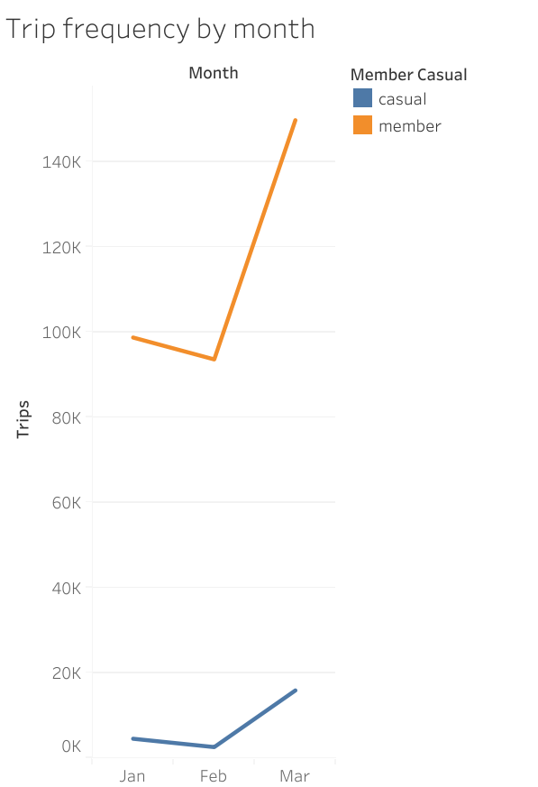
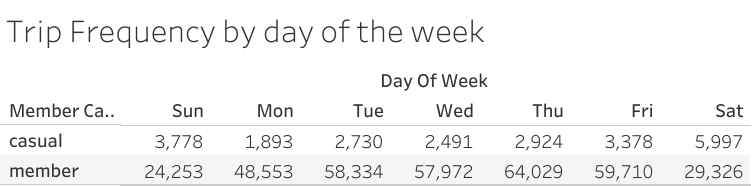
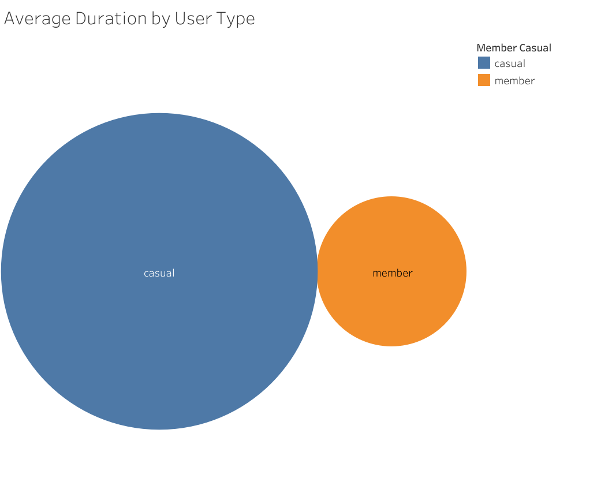
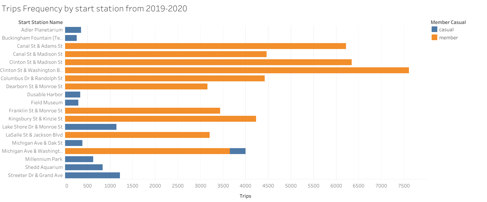

# Cyclistic Case Study: Analyzing Member vs Casual Rider Behavior

## Project Overview
Cyclistic is a bike-share company that wants to increase annual memberships by understanding how casual riders use bikes differently from members. This project analyzes historical trip data to uncover trends and provide insights for marketing and operational decisions.

**Objective:**  
- Answer the question: *“How do annual members and casual riders use Cyclistic bikes differently?”*  
- Identify trends that can help convert casual riders to members.

---

## Business Task
- Compare usage patterns of annual members vs casual riders.  
- Identify temporal, geographic, and trip duration patterns.  
- Provide actionable recommendations for marketing campaigns and operational planning.

**Key Stakeholders:**  
- Marketing team  
- Operations team  
- Product managers  

---

## Data Sources
Data was sourced from **Divvy bike-share datasets**, publicly available via Motivate International.  
- `Divvy_Trips_2019_Q1.csv`: [View the Google Sheets template](https://docs.google.com/spreadsheets/d/1uCTsHlZLm4L7-ueaSLwDg0ut3BP_V4mKDo2IMpaXrk4/template/preview?resourcekey=0-dQAUjAu2UUCsLEQQt20PDA#gid=1797029090) 
- `Divvy_Trips_2020_Q1.csv`: [View the Google Sheets template](https://docs.google.com/spreadsheets/d/179QVLO_yu5BJEKFVZShsKag74ZaUYIF6FevLYzs3hRc/template/preview#gid=640449855)

**Columns (standardized for analysis using R):**  
`ride_id` | `bike_type` | `started_at` | `ended_at` | `start_station_name` | `start_station_id` | `end_station_name` | `end_station_id` | `start_lat` | `start_lng` | `end_lat` | `end_lng` | `member_casual` | `gender` | `birthyear`  

**Privacy & Licensing:**  
- No personally identifiable information was used.  
- Data is used under public license for analysis purposes.  

---

## Data Cleaning & Preparation
- Standardized column names across datasets.  
- Converted `started_at` and `ended_at` to datetime format.  
- Calculated `tripduration` in minutes.
- Merged the two datasets into one for easy analysis
- Removed duplicates and trips with zero or negative durations.  

---

## Descriptive Analysis
1. **Trips by Rider Type**    
   - Average trip duration differs between groups.  

2. **Trips by Day of the Week**  
   - Members ride more on weekdays (commuting pattern).  
   - Casual riders spike on weekends.  

3. **Trips by Month**   
   - Casual riders show seasonal spikes (Large spike during Spring time).  

4. **Top Start Stations**  
   - Identified most popular stations for members and casual riders.   

---

## Visualizations
- **Viz 1:** Trips by month for each rider type.
- 
- **Viz 2:** Trips by day of the week.
-  
- **Viz 3:** Distribution of trip durations by rider type.
-   
- **Viz 4:** Top 10 most popular stations 
-  

---

## Key Insights
- Members take more frequent, shorter trips, often commuting.  
- Casual riders ride less often but take longer trips, mostly on weekends or during seasonal spikes.  
- Significant growth in casual trips during March suggests opportunity for marketing conversion.  
- Station usage patterns indicate where promotions or campaigns can be targeted. (Michigan Ave and Washington Str is has in the top 10 most popular stations and has the most even distribution of member types)

---

## Recommendations
1. **Target Seasonal Campaigns**  
   - Promote memberships in early spring when casual usage spikes.  

2. **Target Stations that Casuals Frequent**  
   - Target the Top 10 stations for casuals, especially Michigan Ave and Washington Str

3. **Weekend Promotions**  
   - Focus marketing on the weekends because that is where Casuals make use of the product the most and Members use is the least  

---

## Technologies Used
- **R**: Data cleaning, transformation, descriptive analysis  
- **Tableau**: Visualizations  
- **Google Sheets / Excel**: Some data cleaning and manipulations  

---

## Files in Repository
- `Cyclist_Project.R` → Script for standardizing, cleaning data and performing descriptive summaries of data 
- `summaries/` → CSV summaries: trips_by_day, trips_by_type, top_stations, trips_by_month  

