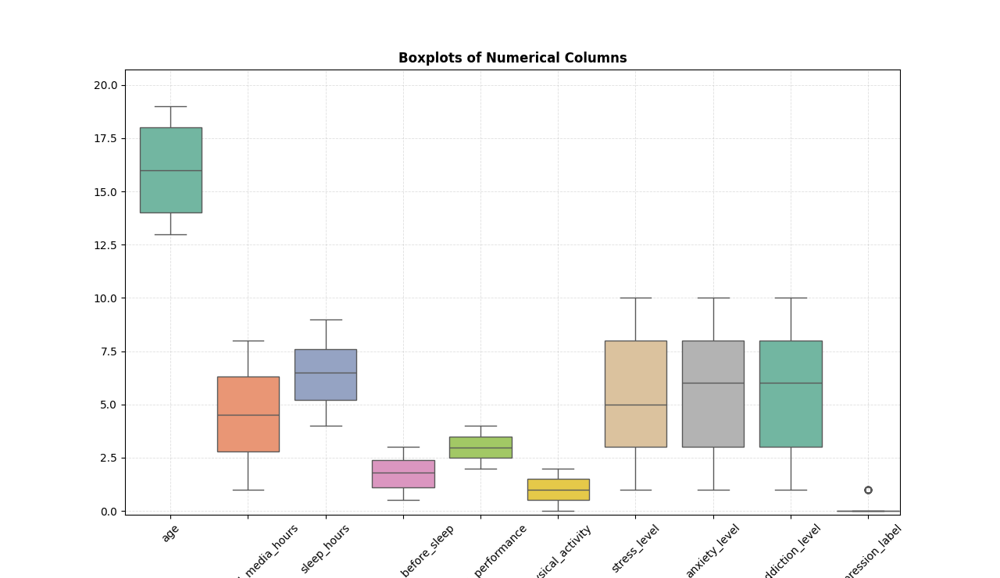

# Teen Mental Health Dataset – Exploratory Data Analysis Report

## Introduction

This report presents an exploratory data analysis (EDA) of a teen mental health dataset using Python libraries such as Pandas, NumPy, Matplotlib, Seaborn, and SciPy. The purpose of the analysis was to examine the structure and quality of the dataset, identify behavioral patterns related to social media usage, and explore variables connected to teen mental health outcomes.

The analysis focused on:

- Dataset structure and descriptive statistics
- Data quality assessment
- Social media platform usage patterns
- Social interaction levels
- Outlier detection in numerical variables

---

# Tools and Libraries Used

The following Python libraries were used:

- Pandas for data manipulation and exploration
- NumPy for numerical operations
- Matplotlib for visualizations
- Seaborn for advanced plotting
- SciPy for statistical testing

---

# Dataset Overview

The dataset was imported into a Pandas DataFrame and explored using the following functions:

## Head of Dataset

The first five rows of the dataset are shown below:

| age | gender | daily_social_media_hours | platform_usage | stress_level | anxiety_level | addiction_level | depression_label |
|------|------|------|------|------|------|------|------|
| 14 | male | 7.9 | Instagram | 2 | 2 | 1 | 0 |
| 19 | female | 1.9 | TikTok | 8 | 1 | 10 | 0 |
| 17 | female | 1.3 | Instagram | 2 | 4 | 2 | 0 |
| 15 | male | 7.4 | TikTok | 1 | 7 | 9 | 0 |
| 15 | female | 4.7 | Both | 3 | 5 | 2 | 0 |

The dataset contains behavioral and psychological indicators related to:

- Social media usage
- Sleep habits
- Academic performance
- Physical activity
- Stress and anxiety levels
- Addiction tendencies
- Depression classification

---

# Descriptive Statistics

## Numerical Summary

The descriptive statistics generated by `describe()` revealed the following:

| Metric | Observation |
|------|------|
| Total Records | 1200 |
| Average Age | 15.93 years |
| Average Daily Social Media Usage | 4.54 hours |
| Average Sleep Hours | 6.45 hours |
| Average Anxiety Level | 5.64 |
| Average Addiction Level | 5.57 |
| Depression Label Mean | 0.026 |

### Key Insights from Descriptive Statistics

- The dataset primarily represents teenagers aged between 13 and 19 years.
- Teens spend an average of approximately 4.5 hours daily on social media.
- Average sleep duration is approximately 6.4 hours, which may be below recommended sleep levels for teenagers.
- Anxiety and addiction levels show moderate averages, suggesting variability across participants.
- The depression label average of 0.026 indicates that depression cases are relatively limited within the dataset.

### Distribution Highlights

| Variable | Minimum | Maximum |
|------|------|------|
| Daily Social Media Hours | 1.0 | 8.0 |
| Sleep Hours | 4.0 | 9.0 |
| Anxiety Level | 1 | 10 |
| Addiction Level | 1 | 10 |

The wide ranges indicate strong variability in teen behavioral patterns and mental health indicators.

---

# Dataset Structure

The dataset information generated using `df.info()` showed:

- 1200 rows
- 13 columns
- No missing values

## Column Types

| Data Type | Count |
|------|------|
| Integer Columns | 5 |
| Float Columns | 5 |
| Object (Categorical) Columns | 3 |

## Variables Included

### Numerical Variables

- age
- daily_social_media_hours
- sleep_hours
- screen_time_before_sleep
- academic_performance
- physical_activity
- stress_level
- anxiety_level
- addiction_level
- depression_label

### Categorical Variables

- gender
- platform_usage
- social_interaction_level

The dataset size of 1200 observations is suitable for statistical analysis and machine learning applications.

---

# Data Quality Assessment

## Missing Values

The analysis showed that all columns contained:

0 missing values

This indicates:

- High dataset completeness
- No immediate need for imputation techniques
- Strong reliability for further analysis

---

## Duplicate Records

The duplicate check returned:

```python
0 duplicates
```

This confirms:

- No repeated observations
- Reduced risk of biased statistical results
- Improved data integrity

---

# Platform Usage Analysis

The distribution of social media platform usage was analyzed using:

## Results

| Platform | Count |
|------|------|
| Instagram | 411 |
| TikTok | 398 |
| Both | 391 |

## Interpretation

The platform usage distribution is relatively balanced across:

- Instagram users
- TikTok users
- Users engaging with both platforms

### Key Insights

- Instagram had the highest number of users with 411 participants.
- TikTok usage was similarly high with 398 participants.
- A significant portion of teens used both platforms simultaneously.

This balanced distribution makes the dataset valuable for comparative analysis between platform usage behaviors and mental health indicators.

Potential future analyses may investigate:

- Whether heavier platform usage correlates with higher anxiety levels
- Differences in addiction levels between platforms
- The relationship between multi-platform use and sleep quality

---

# Social Interaction Level Analysis

The social interaction levels were analyzed using:


## Results

| Social Interaction Level | Count |
|------|------|
| Medium | 416 |
| Low | 415 |
| High | 369 |

## Interpretation

The dataset shows a relatively even distribution of social interaction categories.

### Observations

- Medium social interaction was the most common category.
- Low social interaction levels were nearly equal to medium levels.
- High interaction levels had slightly fewer participants.

### Significance

This distribution is important because social interaction often influences:

- Emotional well-being
- Stress management
- Anxiety levels
- Depression risk

The presence of many participants in the low interaction category may support further investigation into social isolation and digital dependency among teenagers.

---

# Outlier Detection



## Purpose of the Analysis

Outlier detection helps identify:

- Extreme behavioral patterns
- Unusual social media usage habits
- Potential data anomalies
- Participants with exceptionally high stress or anxiety scores

## Overall Interpretation

Overall, the boxplots reveal that:

- Most numerical variables have relatively balanced distributions.
- Extreme outliers are limited across the dataset.
- Anxiety, stress, and addiction variables show the greatest variability.
- The depression label is highly imbalanced, with far fewer positive cases than negative cases.


---


# Key Findings

Based on the exploratory analysis, several important findings emerged:

1. The dataset is complete and clean, with no missing or duplicate values.

2. Teenagers in the dataset spend an average of 4.5 hours daily on social media.

3. Sleep duration averages approximately 6.4 hours, which may indicate reduced sleep quality among participants.

4. Instagram and TikTok usage are almost equally distributed among teens.

5. Social interaction levels are balanced, though low social interaction remains highly prevalent.

6. Anxiety and addiction levels show substantial variability, indicating differences in mental health experiences among participants.

7. The dataset is highly suitable for:
   - Correlation analysis
   - Predictive modeling
   - Classification analysis
   - Behavioral segmentation

---

# Recommendations for Further Analysis

## Correlation Analysis

Investigate relationships between:

- Social media usage and anxiety
- Sleep hours and stress levels
- Addiction level and depressio


---

# Conclusion

The exploratory analysis provided valuable insight into teen social media behavior and mental health indicators. The dataset is well-structured, complete, and suitable for advanced analytics and predictive modeling.

Key findings showed moderate-to-high daily social media usage, balanced platform preferences, and varying levels of anxiety, addiction, and social interaction among teenagers. The analysis also highlighted the importance of examining relationships between digital behavior and mental health outcomes.

Overall, this dataset offers strong potential for future statistical analysis, behavioral research, and predictive mental health applications aimed at understanding and improving adolescent well-being.
